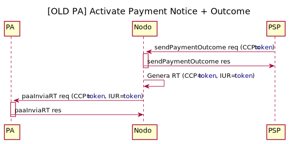

<!-- 
plantuml -tsvg api-definitions/openapi/description.md 
-->
# Introduction

This is the documentation of the pagoPA API for Payment Service Provider. This API enables a PSP  to pay a pagoPA Payment Notice according to _CAD (Codice Amministrazione Digitale)_

The payment process defined below starting from the infrastructures made available by the PSP such as, for example, ATMs, Home banking and mobile payment applications, post offices, etc. The acquisition of the information necessary to communicate with the platform is contained within a `QR-CODE` present in the payment notice which can facilitate data entry. The same information is present in the notice to allow manual entry

### Mock EC environment by [PagoPA](https://www.pagopa.gov.it/) 🧑‍💻
_to test these new primitives as PSP, PagoPA has made available a PA mock, in a UAT_   

See [here](https://github.com/pagopa/pagopa-api/blob/develop/mockPA/README.md) to details.

### API NodoSPC payment : **PA side**
_Reference API PA side is available [here](https://pagopa.github.io/pagopa-api/indexPA.html)_

### Payment process activated by the PSP

<!-- https://github.com/pagopa/pagopa-analisi/blob/main/PlantUML/Sequence/modelli/nuovoModello3_ENG.puml -->

<!-- 
@startuml uml_diag/seqdiag-wisplightnuovoModello3_newPA
title Payment process activated by the PSP

participant EC
participant pagoPA
participant PSP
actor       User

== verify phase (optional) ==

User [#blue]-> PSP: Payment Notice

alt QR-CODE
    PSP -> pagoPA: verifyPaymentNotice req
    note right : The PSP requests the verification of the notice \n (check amount)
    activate pagoPA
    pagoPA -> EC: paVerifyPaymentNotice req
    note left #aqua : Debt Position\n STATUS = **Open**
    activate EC
    EC -> pagoPA: paVerifyPaymentNotice res
    deactivate EC
    pagoPA -> PSP: verifyPaymentNotice res
    deactivate pagoPA
else BARCODE-128-AIM 
    PSP -> pagoPA: verificaBollettino req
    activate pagoPA
    pagoPA -> EC: paVerifyPaymentNotice req
    note left #aqua : Debt Position\n STATUS = **Open**
    activate EC
    EC -> pagoPA: paVerifyPaymentNotice res
    deactivate EC
    pagoPA -> PSP: verificaBollettino res
    deactivate pagoPA
end

PSP [#blue]-> User: Notice verified and updated

== activate phase ==

User [#blue]-> PSP: Confirm willingness to pay
PSP -> pagoPA: activatePaymentNotice req
note right : The PSP requires payment activation
activate pagoPA
pagoPA -> pagoPA: token generation (<color blue>token</color>)
pagoPA -> EC: paGetPayment req
note left #aqua : Debt Position\n STATUS = **Open**
activate EC
EC -> pagoPA: paGetPayment res
deactivate EC
pagoPA -> PSP: activatePaymentNotice res (<color blue>token</color>)
note right : The PSP has all data \nto allow the payment
deactivate pagoPA

PSP [#blue]-> User: Payment page
note left EC #pink : Newly configured ECs \n**DOES'NT HAVE TO** lock the debt position \nafter activation.

== send receipt phase ==

User [#blue]-> PSP: Pay
note right PSP : If payment OK ->  Outcome +\nIf payment KO -> Outcome -

PSP -> pagoPA: sendPaymentOutcome req (<color blue>token</color>)
activate pagoPA
pagoPA -> PSP: sendPaymentOutcome res
deactivate pagoPA
opt Only in case of outcome + 
    pagoPA -> pagoPA: receipt generation (idReceipt=<color blue>token</color>)
    loop for each EC in transfer list
        pagoPA -> EC: paSendRT req (idReceipt=<color blue>token</color>)
        activate EC
        EC -> pagoPA: paSendRT res
        deactivate EC
    end 
    note left EC #aqua: Debt Position\n STATUS = **Open -> Closed
end

@enduml
-->

**Please notice: this API is subject to small changes since it is in final test release**

## Identification and Authentication

Use of this API is restricted to PSP, or 3rd parties ( named as brokers ) which have signed a contract with [PagoPA S.p.A.](https://www.pagopa.gov.it/it/pagopa-spa/) as stated _[here](https://www.pagopa.gov.it/it/prestatori-servizi-di-pagamento/)_

Both PSPs and Brokers are identified with an identifier (`idPSP`, `idBroker`)  assigned by PagoPA S.p.A.

Formally, any API request is coming from a broker on behalf of a PSP which is responsable of the payment.

| Field   |      Description      |  Example value |
|:----------:|-------------|------|
| **idPSP** | Code used in the primitive web service of conversation and in the objects exchanged with the NodoSPC. The code is generally represented by the BIC code of the PSP. In the absence of the BIC code, or to handle particular situations, another code can be used, as long as it uniquely identifies the PSP. | AGID_01 |
| **idBroker** | Identification of the PSP intermediary who provides the specific access (**idChannel**) to the PSP for the delivery of the service. _Notes: The intermediary can coincide with the PSP itself._ | 97735020584 |
| **idChannel**| channel identifier through which the transaction is carried out. It belongs to only one Intermediary therefore he must be unique with respect to the PSP | 97735020584_02 |
| **password**| channel password | _assigned by [PagoPa](https://www.pagopa.gov.it/it/pagopa-spa/servizi-psp/)_|

## Verifica Bollettino
Below is the detailed diagram of this phase
<!-- https://github.com/pagopa/pagopa-analisi/blob/main/PlantUML/Sequence/businessProcess/verificaBollettino.puml -->

<!-- 
@startuml uml_diag/verificaBollettino
title Verifica Bollettino

participant EC
participant pagoPA
participant PSP

PSP -> pagoPA: verificaBollettino req
activate pagoPA
pagoPA -> EC: paVerifyPaymentNotice req
activate EC
EC -> pagoPA: paVerifyPaymentNotice res
deactivate EC
pagoPA -> PSP: verificaBollettino res
deactivate pagoPA

@enduml
-->

## Verify Phase
Below is the detailed diagram of this phase

<!-- https://github.com/pagopa/pagopa-analisi/blob/main/PlantUML/Sequence/businessProcess/verifyPaymentNotice.puml -->
<!-- 
@startuml uml_diag/verifyPaymentNotice_newPA
title Verify Payment Notice 

participant EC
participant pagoPA
participant PSP

PSP -> pagoPA: verifyPaymentNotice req
activate pagoPA
pagoPA -> EC: paVerifyPaymentNotice req
activate EC
EC -> pagoPA: paVerifyPaymentNotice res
deactivate EC
pagoPA -> PSP: verifyPaymentNotice res
deactivate pagoPA

@enduml
-->

## Activation Phase
Below is the detailed diagram of this phase

<!-- https://github.com/pagopa/pagopa-analisi/blob/main/PlantUML/Sequence/businessProcess/activatePaymentNotice.puml -->
<!-- 
@startuml uml_diag/activatePaymentNotice_newPA
title Activate Payment Notice

participant EC
participant pagoPA
participant PSP

PSP -> pagoPA: activatePaymentNotice req
activate pagoPA
pagoPA -> pagoPA: token generation (<color blue>token</color>)
pagoPA -> EC: paGetPayment req
activate EC
EC -> pagoPA: paGetPayment res
deactivate EC
pagoPA -> PSP: activatePaymentNotice res (<color blue>token</color>)
deactivate pagoPA

@enduml
-->

## Receipt Phase
Below is the detailed diagram of this phase

<!-- https://github.com/pagopa/pagopa-analisi/blob/main/PlantUML/Sequence/businessProcess/sendPaymentOutcome.puml -->
<!-- 
@startuml uml_diag/outcomeOK
title Send Payment Outcome

participant EC
participant pagoPA
participant PSP

PSP -> pagoPA: sendPaymentOutcome req (<color blue>token</color>)
activate pagoPA
pagoPA -> PSP: sendPaymentOutcome res
deactivate pagoPA
pagoPA -> pagoPA: receipt generation (idReceipt=<color blue>token</color>)

loop for each EC in transfer list
    pagoPA -> EC: paSendRT req (idReceipt=<color blue>token</color>)
    activate EC
    EC -> pagoPA: paSendRT res
    deactivate EC
end 

@enduml
-->

