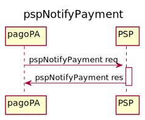

<!--
plantuml -tsvg api-definitions/openapi/description.md
-->

# Introduction

This is the documentation for Payment Service Provider. This API shall be provided from any PSP ( or 3rd parties ) that want to provide a payment mthod for any PagoPA users 

The payment process defined below starting from the Client  made available by PagoPA SpA such as, for example, [appIO](http://io.italia.it), PagoPA site.
The on-line payment is provided by means of a Payment Gateway provided by the PSP itself. All founds are collected into a techical account,  the following interfaces are needed to complete the pagopA payment process in order to transfer founds to the Public Administration.

### API NodoSPC payment : **PSP side client**
_Reference API PSP side is available [here](https://pagopa.github.io/pagopa-api/index.html)_

## Identification and Authentication

Provisioning of this API is restricted to PSP, or 3rd parties ( named as brokers ) which have signed a contract with [PagoPA S.p.A.](https://www.pagopa.gov.it/it/pagopa-spa/) as stated _[here](https://www.pagopa.gov.it/it/prestatori-servizi-di-pagamento/)_

Both PSPs and Brokers are identified with an identifier (`idPSP`, `idBroker`) assigned by PagoPA S.p.A.

|     Field     | Description                                                                                                                                                                                                                                                                                                  | Example value                                                                |
| :-----------: | ------------------------------------------------------------------------------------------------------------------------------------------------------------------------------------------------------------------------------------------------------------------------------------------------------------ | ---------------------------------------------------------------------------- |
|   **idPSP**   | Code used in the primitive web service of conversation and in the objects exchanged with the NodoSPC. The code is generally represented by the BIC code of the PSP. In the absence of the BIC code, or to handle particular situations, another code can be used, as long as it uniquely identifies the PSP. | AGID_01                                                                      |
| **idBroker**  | Identification of the PSP intermediary who provides the specific access (**idChannel**) to the PSP for the delivery of the service. _Notes: The intermediary can coincide with the PSP itself._                                                                                                              | 97735020584                                                                  |
| **idChannel** | channel identifier through which the transaction is carried out. It belongs to only one Intermediary therefore he must be unique with respect to the PSP                                                                                                                                                     | 97735020584_02                                                               |

## pspNotifyPayment Phase
Below is the detailed diagram of this phase

<!-- https://github.com/pagopa/pagopa-analisi/blob/main/PlantUML/Sequence/primitive/pspNotifyPayment.puml -->
<!-- 
@startuml uml_diag/pspNotifyPayment
title pspNotifyPayment

participant pagoPA
participant PSP

pagoPA -> PSP: pspNotifyPayment req
activate PSP
PSP -> pagoPA: pspNotifyPayment res
deactivate PSP

@enduml
-->

